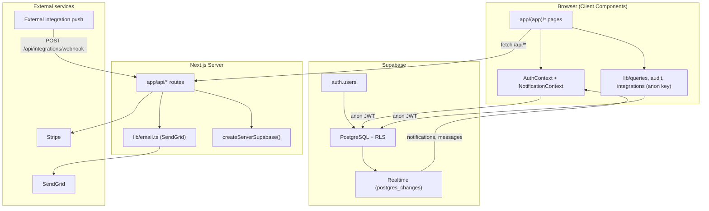

# PHASE 1 — Platform Audit & Architecture Review

**Platform:** VAC-P (Virtual Accountability & Collaboration Platform)  
**Organization:** Sybella Systems Ltd  
**Audit date:** June 2026  
**Scope:** Read-only codebase analysis — no implementation changes in Phase 1

---

## 1. Executive summary

VAC-P is a **Next.js 13 App Router** internal operations platform backed by **Supabase** (PostgreSQL + Auth + Realtime). It provides role-based workspaces for projects, accountability, finance, HR, messaging, wiki, and governance. The architecture is sound for an internal tool: client-side data access via Supabase anon key with RLS, centralized auth context, and a comprehensive PostgreSQL schema.

**Maturity:** Feature-rich MVP with ~28 pages, 11 API routes, 30+ database tables, and 14 roles. Several Phase 2–12 requirements have partial foundations (projects, messaging, import scaffolding, analytics charts) but lack offline sync, unified settings, advanced PM views, marketing ops, asset vault, and automation engine.

**Critical finding:** Server/client Supabase boundary is partially correct (integration and broadcast APIs use service role) but `lib/email.ts` references an undefined `supabase` client and a non-existent `email_queue` table. Role enum mismatch exists between `lib/rbac.ts` (`ceo`, `operations`, `customer_support`) and DB CHECK constraint (missing those three roles).

---

## 2. Technology stack

| Layer | Technology | Version / notes |
|-------|------------|-----------------|
| Framework | Next.js (App Router) | 13.5.1 |
| UI | React, Tailwind CSS, Radix UI (shadcn) | React 18.2 |
| Language | TypeScript | 5.2.2 |
| Backend / DB | Supabase (PostgreSQL, Auth, Realtime) | `@supabase/supabase-js` 2.58 |
| Charts | Recharts | 2.12.7 |
| Forms | react-hook-form + zod | — |
| Email | SendGrid API | via `lib/email.ts` |
| Payments | Stripe Checkout (REST) | `app/api/stripe/*` |
| Hosting | Netlify | `@netlify/plugin-nextjs`, `netlify.toml` |
| PWA | manifest.json + service worker | `public/manifest.json`, `components/ServiceWorkerRegister.tsx` |

**Environment variables (observed in code):**

- `NEXT_PUBLIC_SUPABASE_URL`, `NEXT_PUBLIC_SUPABASE_ANON_KEY` — client
- `SUPABASE_URL`, `SUPABASE_SERVICE_ROLE_KEY` — server (`createServerSupabase()`)
- `SENDGRID_API_KEY`, `SENDGRID_FROM_EMAIL`, `ENABLE_EMAIL_QUEUE`
- `VACP_INTEGRATIONS_WEBHOOK_SECRET`
- `STRIPE_SECRET_KEY`, `NEXT_PUBLIC_STRIPE_PRICE_*`, `NEXT_PUBLIC_APP_URL`

---

## 3. System architecture map

### 3.1 Request / auth flow

1. User visits `/` → redirects to `/dashboard` (authenticated) or `/login`.
2. `app/(app)/layout.tsx` wraps all authenticated routes: if no Supabase session, redirect to `/login`.
3. `AuthContext` (`contexts/AuthContext.tsx`):
   - Calls `supabase.auth.getSession()` and `onAuthStateChange`.
   - Loads `profiles` row for the authenticated user.
   - Exposes `signIn`, `signInWithProvider` (Google, GitHub, Azure, LinkedIn), password reset, `signOut`.
4. **No Next.js middleware** — route protection is client-side only in `(app)/layout.tsx`.
5. **No server-side session validation** on API routes except webhook secret checks; broadcast and integration routes use service role without caller auth.

### 3.2 Layout structure

| Path | Purpose |
|------|---------|
| `app/layout.tsx` | Root: `AuthProvider`, `NotificationProvider`, PWA service worker, toaster |
| `app/(app)/layout.tsx` | Authenticated shell: `Sidebar`, `MobileNav`, auth guard |
| `app/login/page.tsx` | Login + OAuth + forgot password |
| `app/unauthorized/page.tsx` | Access denied (used by admin-only pages) |

### 3.3 Data access pattern

- **Client pages** import `supabase` from `lib/supabase.ts` (anon key) and query tables directly.
- **Privileged API routes** use `createServerSupabase()` (service role): integrations webhook, project integrations GET, notifications broadcast.
- **Unprotected API routes:** `app/api/email/route.ts`, `app/api/stripe/checkout/route.ts`, `app/api/stripe/webhook/route.ts` — no auth on caller.

---

## 4. Route inventory (28 pages)

### 4.1 Authenticated app routes (`app/(app)/`)

| Route | File | Primary tables / libs | Nav in `lib/rbac.ts` |
|-------|------|----------------------|----------------------|
| `/dashboard` | `dashboard/page.tsx` | profiles, projects, customers, tasks, financial_records | Yes |
| `/accountability` | `accountability/page.tsx` | accountability_reports, profiles, tasks, projects | Yes |
| `/approvals` | `approvals/page.tsx` | leave_requests, approval_workflows, profiles | Yes |
| `/messages` | `messages/page.tsx` | channels, channel_members, messages, tasks | Yes |
| `/notifications` | `notifications/page.tsx` | notifications (admin broadcast UI) | Yes (admin only) |
| `/projects` | `projects/page.tsx` | projects, tasks, task_subtasks, project_integrations, project_feature_links | Yes |
| `/project-office` | `project-office/page.tsx` | projects, tasks | Yes (manager) |
| `/my-work` | `my-work/page.tsx` | tasks | Yes (developer/designer/qa) |
| `/customers` | `customers/page.tsx` | customers | Yes |
| `/sales-pipeline` | `sales-pipeline/page.tsx` | customers | Yes |
| `/finance` | `finance/page.tsx` | financial_records | Yes |
| `/finance-console` | `finance-console/page.tsx` | financial_records, budget_proposals | Yes |
| `/budget` | `budget/page.tsx` | budget_proposals, approval_workflows | Yes |
| `/audit-logs` | `audit-logs/page.tsx` | audit_logs | Yes |
| `/legal` | `legal/page.tsx` | Hub links to wiki, shares, budget | Yes |
| `/analytics` | `analytics/page.tsx` | projects, tasks, profiles, accountability_reports, financial_records, project_integrations | Yes |
| `/team` | `team/page.tsx` | profiles | Yes |
| `/hr` | `hr/page.tsx` | hr_candidates, hr_performance_reviews, hr_onboarding_tasks, profiles | Yes |
| `/leave` | `leave/page.tsx` | leave_requests, profiles | Yes |
| `/shares` | `shares/page.tsx` | shares, ownership_records, share_allocations, profiles | Yes |
| `/wiki` | `wiki/page.tsx` | wiki_pages (`lib/queries`) | Yes |
| `/repo-links` | `repo-links/page.tsx` | repo_links | Yes |
| `/admin` | `admin/page.tsx` | profiles (role/active toggles) | **No — orphan route** |
| `/billing` | `billing/page.tsx` | Stripe checkout UI | **No — orphan route** |
| `/marketing` | `marketing/page.tsx` | Hub links only | **No — orphan route** |

### 4.2 Public routes

| Route | File |
|-------|------|
| `/` | `app/page.tsx` — redirect hub |
| `/login` | `app/login/page.tsx` |

---

## 5. API route inventory (11 handlers)

| Method | Path | Auth | Supabase client | Purpose |
|--------|------|------|-----------------|---------|
| POST | `/api/email` | None | N/A | Send transactional email via SendGrid |
| POST | `/api/notifications/broadcast` | None | Service role | Insert notification for all active profiles |
| POST | `/api/integrations/webhook` | `x-vacp-secret` header | Service role | External systems push integration payload |
| GET | `/api/integrations/project/[projectId]` | None | Service role | List integrations (+ optional live fetch) |
| GET | `/api/integrations/project/[projectId]/latest` | None | Service role | Latest pushed integration data |
| POST | `/api/stripe/checkout` | None | N/A | Create Stripe checkout session |
| POST | `/api/stripe/webhook` | None | N/A | Log Stripe events to audit_logs |

---

## 6. Feature audit by domain

### 6.1 Authentication

**Exists:**
- Email/password login (`AuthContext.signIn`)
- OAuth buttons: Google, GitHub, Azure (`signInWithProvider`)
- Password reset via Supabase (`sendPasswordResetEmail`)
- Profile auto-linked via DB trigger on `auth.users` insert
- Session persisted in Supabase client

**Gaps (Phase 3):** 2FA/MFA, session management UI, device list, login history, SSO/SAML, password policy UI

### 6.2 User management

**Exists:**
- `profiles` table with full_name, email, role, department, avatar, bio, is_active, notification_preferences
- `/team` — view/edit team members
- `/admin` — role assignment, activate/deactivate users (orphan route, no nav link)

**Gaps:** Self-service profile settings page, invitation flow, bulk import, org chart

### 6.3 Role management

**Exists:**
- 14 roles in `lib/rbac.ts`: admin, director, manager, developer, designer, qa, sales, hr, finance, legal_counsel, marketing_manager, customer_support, operations, ceo
- DB CHECK allows 12 roles (missing ceo, operations, customer_support) — **schema drift risk**
- Nav filtering via `navSectionsForRole()` in `lib/rbac.ts`
- Helper functions: `canManageShares`, `canApproveLeave`, `canEditWiki`, `canViewAllLeave`
- RLS policies enforce role checks on sensitive tables (financial_records, shares, wiki)

**Gaps:** Settings UI for role/permission management, project-level RBAC beyond assignments

### 6.4 Dashboards

**Exists:**
- `/dashboard` — KPI cards, revenue/expense charts (Recharts), recent projects/tasks
- `/analytics` — cross-module charts (projects, tasks, accountability, finance, integrations)
- `/project-office` — manager project overview
- `/finance-console` — finance-specific console
- Role-specific hubs: `/my-work`, `/marketing`, `/legal` (mostly link aggregators)

**Gaps (Phase 8):** CEO/MD/PM/Team Lead dedicated dashboards, velocity metrics, resource utilization, strategic goals tracking

### 6.5 Project management

**Exists:**
- CRUD projects, tasks, subtasks (`projects/page.tsx`)
- Project assignments with role_in_project (viewer/editor/admin) and capability flags
- Project templates dialog (`components/ProjectTemplatesDialog.tsx`)
- Import wizard component (`components/ProjectImportWizard.tsx`)
- Import/export lib (`lib/project-import-export.ts`) — CSV parse, custom fields, project_rows
- Project integrations (create, webhook push, live fetch)
- Project feature links (customer, financial_record, budget_proposal, wiki_page, repo_link)
- Project analytics table + dashboard component
- Accountability reports linked to projects/tasks

**Gaps (Phase 4):** Kanban/Scrum boards, Gantt/calendar/timeline views, epics, dependencies, milestones, risks, deliverables, time tracking, archive flow, automatic reminders

### 6.6 Communication

**Exists:**
- Channels (public/private/direct), channel_members, messages with realtime potential
- `/messages` — channel list, send messages, task creation from chat
- `task_messages` table for task-scoped discussion
- Notifications with Supabase Realtime subscription (`NotificationContext`)
- Browser push + in-app toast for new notifications

**Gaps (Phase 5):** Direct messages UX, mentions, attachments, voice/video, screen share, threaded task comments UI

### 6.7 Analytics & reporting

**Exists:**
- `/analytics` — aggregated charts
- `/accountability` — structured role-based report templates (`lib/accountability.ts`), submit/review workflow
- `company_metrics` table (admin/director RLS)
- `project_analytics` table
- Audit trail (`audit_logs` + `lib/audit.ts`)

**Gaps:** Scheduled reports, PDF export, executive roll-ups, automation-triggered reports

### 6.8 Finance & governance

**Exists:**
- `financial_records`, `budget_proposals`, `approval_workflows`, `project_budget_links`
- `/finance`, `/budget`, `/approvals`, `/shares`, `/audit-logs`
- Stripe billing UI at `/billing` (partial SaaS path)

**Gaps:** Invoice generation, subscription state in DB, full approval escalation engine

### 6.9 HR & people

**Exists:**
- `hr_candidates`, `hr_performance_reviews`, `hr_onboarding_tasks`
- `/hr`, `/leave`, `/team`
- Leave approval integrated with `/approvals`

**Gaps:** Full ATS, payroll integration, holiday calendar in settings

### 6.10 Knowledge & reference

**Exists:**
- `wiki_pages` with templates, categories, publish workflow (`lib/queries.ts` wiki helpers)
- `/wiki` — full CRUD with search/filter
- `repo_links` — repository link registry

**Gaps (Phase 10):** Version history, granular permissions, SOP sections structure

### 6.11 Integrations

**Exists:**
- `project_integrations` with auth types (none, apikey, basic, bearer, oauth placeholder)
- Webhook ingest at `/api/integrations/webhook`
- Server-side live fetch in integration API routes
- Audit logging on webhook push

**Gaps:** OAuth token refresh, outbound webhooks, Slack/Teams connectors

### 6.12 Offline / PWA

**Exists:**
- `manifest.json`, service worker registration, update toast
- Notification preferences in localStorage + profiles.notification_preferences

**Gaps (global requirement):** IndexedDB queue, background sync, conflict resolution — **not implemented**

---

## 7. Database summary

**Migrations:** 8 files in `supabase/migrations/` (May–June 2026)

**Core tables (30):**

`profiles`, `customers`, `projects`, `project_assignments`, `tasks`, `task_subtasks`, `channels`, `channel_members`, `messages`, `task_messages`, `accountability_reports`, `financial_records`, `company_metrics`, `notifications`, `shares`, `ownership_records`, `share_allocations`, `wiki_pages`, `repo_links`, `leave_requests`, `budget_proposals`, `approval_workflows`, `audit_logs`, `project_feature_links`, `project_budget_links`, `hr_candidates`, `hr_performance_reviews`, `hr_onboarding_tasks`, `project_integrations`, `project_custom_fields`, `project_rows`, `project_analytics`, `import_jobs`, `project_templates`

**RLS:** Enabled on all tables; policies vary from open authenticated read (projects, tasks) to role-restricted (financial_records, shares, company_metrics).

See `DB_RELATIONSHIP_DIAGRAM.mmd` for ER diagram.

---

## 8. Shared libraries & components

| Module | Path | Role |
|--------|------|------|
| Supabase clients | `lib/supabase.ts` | Anon client + `createServerSupabase()` |
| Types | `lib/database.types.ts` | Canonical TS types (partial `Database = any`) |
| RBAC / nav | `lib/rbac.ts` | Role lists, nav sections, permission helpers |
| Queries | `lib/queries.ts` | Wiki, notifications fetch helpers |
| Audit | `lib/audit.ts` | Client-side audit insert (best-effort) |
| Email | `lib/email.ts` | SendGrid + template builders (**bug: undefined supabase in queueEmail**) |
| Integrations | `lib/integrations.ts` | CRUD + external fetch |
| Import/export | `lib/project-import-export.ts` | CSV parse, import jobs |
| Analytics | `lib/project-analytics.ts` | Project metric helpers |
| Accountability | `lib/accountability.ts` | Role report templates |
| Task-chat | `lib/task-chat-integration.ts` | Task/message bridge |

**Feature components:** `ProjectAnalyticsDashboard`, `ProjectImportWizard`, `ProjectTemplatesDialog`, `TaskAssignmentForm`, layout (`Sidebar`, `MobileNav`, `TopBar`)

**UI:** 40+ shadcn/Radix components under `components/ui/`

---

## 9. What works today — do NOT break

These flows are production-critical and must remain functional through all upgrade phases:

1. **Login / logout** — email, OAuth, password reset
2. **Role-based sidebar navigation** — `lib/rbac.ts` + `(app)/layout.tsx` guard
3. **Projects CRUD** — projects, tasks, subtasks, members, integrations
4. **Messages** — channel messaging and task creation from chat
5. **Accountability reports** — submit and review cycle
6. **Budget proposals + approval workflows** — multi-step approval in `/budget` and `/approvals`
7. **Leave requests** — submit and manager approval
8. **Wiki** — publish/unpublish, templates, categories
9. **Notifications realtime** — `NotificationContext` postgres_changes subscription
10. **Shares / HR / Finance** — RLS-protected data modules
11. **Integration webhook** — external push with secret validation
12. **Audit logging** — `logAudit()` calls across sensitive actions

---

## 10. Gap analysis vs Phases 2–12 (summary)

| Phase | Theme | Current state | Gap severity |
|-------|-------|---------------|--------------|
| 2 | Global UX | Responsive layout exists; large single-page forms | Medium — refactor risk |
| 3 | Settings center | Notification prefs only; admin panel partial | High — new module |
| 4 | PM suite | Core CRUD + subtasks; no boards/Gantt/time | High |
| 5 | Communication hub | Channels exist; no DM/video/mentions | High |
| 6 | Import center | CSV + custom fields started; XLSX stub; no offline sync | Medium–High |
| 7 | Marketing ops | Hub page links only; no campaigns/calendar | High |
| 8 | Executive dashboards | Generic dashboard/analytics | High |
| 9 | Asset vault | repo_links only; no credential vault | High |
| 10 | Wiki/KB | Wiki works; no version history | Medium |
| 11 | Automation | No job queue or reminder engine | High |
| 12 | Testing | CI lint/build/typecheck; smoke script only | High |

---

## 11. Related deliverables

- `PHASE_1_AUDIT_REPORT.md` — consolidated findings and Phase 2 blockers
- `PHASE_1_DEPENDENCY_MAP.md` — module and feature dependency graph
- `DB_RELATIONSHIP_DIAGRAM.mmd` — full ER diagram
- `RISK_ASSESSMENT.md` — prioritized risk register
- `UPGRADE_ROADMAP.md` — Phases 1.5–12 plan with estimates and rollback notes
- `CODEBASE_SAFEUPGRADE_CHECKLIST.md` — pre-change safety checklist

---

*Phase 1 audit complete. No application feature implementation was started.*
