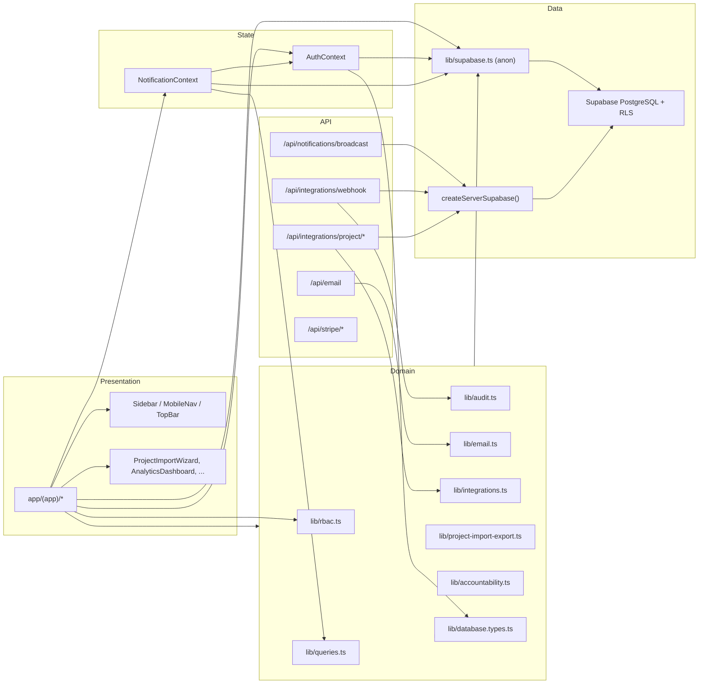
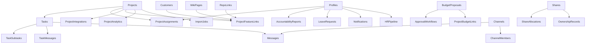

# PHASE 1 — Feature & Module Dependency Map

**Platform:** VAC-P  
**Purpose:** Show how modules connect today and which upgrade phases touch which dependencies.

---

## 1. Repository structure

```
APPROVED - VAC-P/
├── app/
│   ├── (app)/          # 25 authenticated pages
│   ├── api/            # 7 route files (11 HTTP handlers)
│   ├── login/
│   └── layout.tsx
├── components/
│   ├── layout/         # Sidebar, MobileNav, TopBar
│   ├── ui/             # shadcn primitives (~40)
│   └── *.tsx           # Feature components (4)
├── contexts/           # AuthContext, NotificationContext
├── hooks/              # use-toast, use-document-title
├── lib/                # 14 shared modules
├── supabase/migrations/
├── scripts/            # scan-supabase-usage, test-smoke
└── public/             # manifest, sw.js, icons
```

---

## 2. High-level dependency graph



---

## 3. Auth & session dependencies

| Consumer | Depends on | Notes |
|----------|------------|-------|
| All `(app)/*` pages | `AuthContext`, `(app)/layout.tsx` | Redirect if no user |
| `lib/audit.ts` | `supabase.auth.getUser()` | Client-side actor resolution |
| `lib/rbac.ts` | `profile.role` from AuthContext | Nav + page-level guards |
| `/notifications`, `/admin` | Role check + `/unauthorized` | Page-level guard |
| API routes | Mostly **no auth** | Exception: webhook secret |

**Upgrade impact:** Phase 3 Settings and API hardening (Phase 1.5) must not break `AuthProvider` mount order in `app/layout.tsx`.

---

## 4. Feature → table → page map

| Feature domain | Primary tables | Pages | Lib modules |
|----------------|----------------|-------|-------------|
| Identity | auth.users, profiles | login, team, admin | AuthContext, rbac |
| Projects | projects, project_assignments, tasks, task_subtasks | projects, project-office, my-work | project-import-export, integrations, project-analytics |
| Customers & sales | customers | customers, sales-pipeline, marketing (hub) | — |
| Messaging | channels, channel_members, messages, task_messages | messages | task-chat-integration |
| Notifications | notifications | notifications | NotificationContext, queries |
| Accountability | accountability_reports | accountability | accountability |
| Finance | financial_records, budget_proposals, approval_workflows, project_budget_links | finance, finance-console, budget, approvals | — |
| HR | hr_*, leave_requests | hr, leave, approvals | rbac |
| Governance | shares, ownership_records, share_allocations, audit_logs | shares, audit-logs, legal | audit, rbac |
| Knowledge | wiki_pages, repo_links | wiki, repo-links | queries |
| Analytics | company_metrics, project_analytics + aggregates | dashboard, analytics | project-analytics |
| Integrations | project_integrations | projects (integrations tab) | integrations, API routes |
| Import/data tables | project_custom_fields, project_rows, import_jobs, project_templates | projects (import wizard) | project-import-export, excel-workbook-template |
| Billing | (none persisted) | billing | Stripe API |

---

## 5. Cross-feature dependency edges



**Integration rule for upgrades:** New modules must link through existing spine tables (`projects`, `profiles`, `project_feature_links`, `approval_workflows`, `audit_logs`) to avoid orphan features.

---

## 6. API → lib → table dependencies

| API route | lib | Tables written | Tables read |
|-----------|-----|----------------|-------------|
| POST `/api/email` | `lib/email.ts` | — (SendGrid) | — |
| POST `/api/notifications/broadcast` | — | notifications | profiles |
| POST `/api/integrations/webhook` | `lib/audit.ts` | project_integrations | project_integrations |
| GET `/api/integrations/project/[id]` | `lib/integrations.ts` | project_integrations (last_synced) | project_integrations |
| POST `/api/stripe/checkout` | — | — | — |
| POST `/api/stripe/webhook` | `lib/audit.ts` | audit_logs | — |

---

## 7. External service dependencies

| Service | Used by | Env vars | Phase sensitivity |
|---------|---------|----------|-------------------|
| Supabase Auth/DB/Realtime | Entire app | SUPABASE_* | All phases |
| SendGrid | lib/email, /api/email | SENDGRID_* | Phase 3, 5, 11 |
| Stripe | /api/stripe, /billing | STRIPE_* | Phase 3 billing settings |
| External HTTP | lib/integrations fetchExternalIntegrationData | per integration row | Phase 4, 6 |

---

## 8. Supabase client usage map

**Client anon key** (29 files import `@/lib/supabase`):

- All major `(app)/*` data pages
- `contexts/AuthContext.tsx`, `contexts/NotificationContext.tsx`
- `lib/queries.ts`, `lib/audit.ts`, `lib/integrations.ts`, `lib/project-import-export.ts`
- Feature components: `ProjectTemplatesDialog`, `TaskAssignmentForm`

**Service role** (`createServerSupabase`):

- `app/api/integrations/webhook/route.ts`
- `app/api/integrations/project/[projectId]/route.ts`
- `app/api/integrations/project/[projectId]/latest/route.ts`
- `app/api/notifications/broadcast/route.ts`
- `lib/email.ts` (imported but `queueEmail` uses undefined `supabase` — bug)

Run `npm run scan:supabase` to regenerate this list.

---

## 9. Phase upgrade touch matrix

| Phase | Primary modules touched | Must preserve |
|-------|-------------------------|---------------|
| 2 UX | components/ui, layout, all form pages | All CRUD queries unchanged |
| 3 Settings | new app/(app)/settings, profiles migration | AuthContext, notification prefs |
| 4 PM | projects page, new board views, tasks schema | Existing project/task CRUD |
| 5 Comms | messages, task_messages, notifications | Channel messaging |
| 6 Import | project-import-export, project_rows | CSV import path |
| 7 Marketing | new tables + marketing page | customers, sales-pipeline |
| 8 Dashboards | dashboard, analytics, rbac | Current KPI queries |
| 9 Vault | new vault tables + RLS | audit_logs pattern |
| 10 Wiki | wiki page, queries | Published wiki RLS |
| 11 Automation | new jobs table + API cron | approval_workflows |
| 12 Testing | scripts/, CI | Full regression suite |

---

## 10. Orphan / hidden modules (discovered)

| Route | Issue | Recommendation (Phase 2) |
|-------|-------|--------------------------|
| `/admin` | Not in `lib/rbac.ts` nav | Add to admin-only nav section |
| `/billing` | Not in nav | Add for admin/finance or link from settings |
| `/marketing` | Not in nav | Add for marketing_manager role |

---

*Generated from full codebase pass — June 2026*
