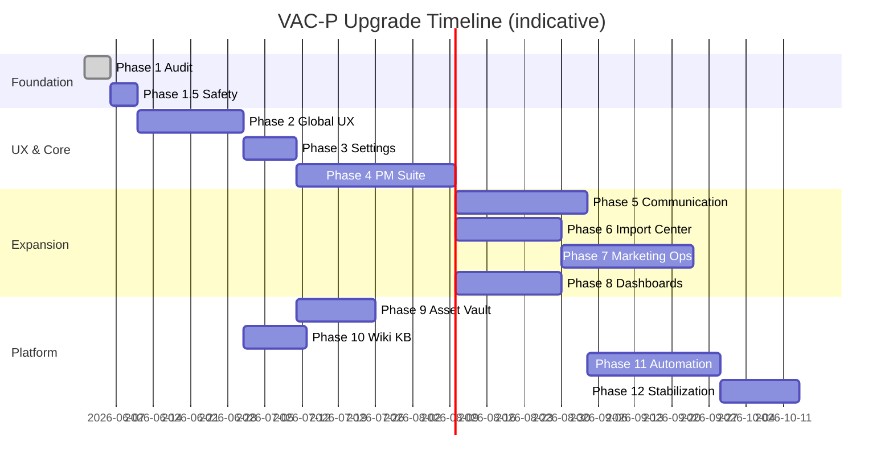
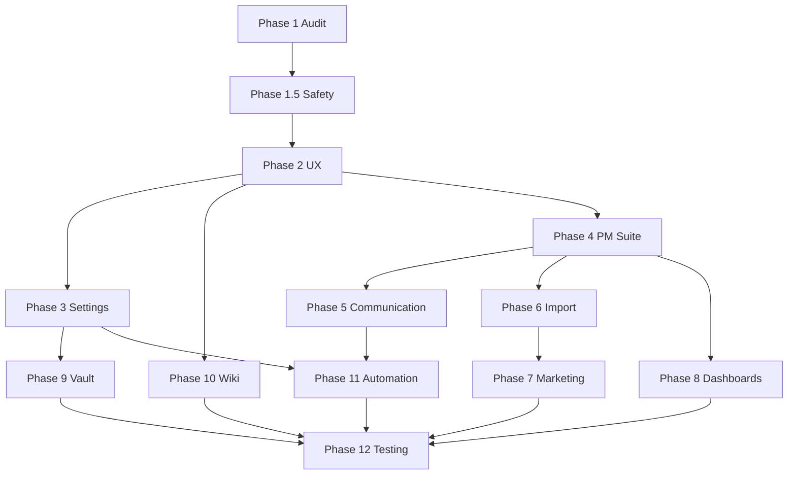

# VAC-P Upgrade Roadmap — Phases 1–12

**Baseline:** Phase 1 audit complete (June 2026)  
**Principle:** Preserve all working features; additive migrations; rollback scripts for every schema change  
**Team assumption:** 1–2 full-stack engineers

---

## Phase overview

Phases 6–8 can partially parallelize after Phase 4 core is stable.

---

## Phase 1 — Platform audit ✅ COMPLETE

**Duration:** 5 days  
**Deliverables:** Architecture map, dependency map, ER diagram, risk assessment, this roadmap

**Exit criteria:**
- [x] Full route/API/table inventory
- [x] Gap analysis vs Phases 2–12
- [x] "Do not break" feature list documented

**Rollback:** N/A (read-only)

---

## Phase 1.5 — Prep & safety (BLOCKING)

**Duration:** 3–5 days  
**Depends on:** Phase 1  
**Priority:** P0 — must complete before Phase 2

### Scope
1. Secure API routes (session or admin key on email, broadcast, integrations GET)
2. Fix `lib/email.ts` queue bug; add `email_queue` migration OR remove dead path
3. Migration: extend `profiles.role` CHECK for ceo, operations, customer_support
4. Stripe webhook signature verification
5. CI: fail on test failure (remove `|| true`); add Playwright smoke (login, dashboard)
6. Staging environment + one migration rollback drill

### Files likely touched
- `app/api/**/route.ts`, `middleware.ts` (new), `lib/email.ts`
- `supabase/migrations/YYYYMMDD_security_and_roles.sql`
- `.github/workflows/ci.yml`, `scripts/test-smoke.js`

### Effort estimate
| Task | Days |
|------|------|
| API auth middleware | 1.5 |
| Role migration + email fix | 1 |
| E2E smoke + CI | 1.5 |
| Staging + rollback test | 1 |

### Rollback notes
- Revert middleware commit if auth breaks login flow
- Role migration down-script restores 12-role CHECK (validate no invalid data)
- Keep feature flags for new API auth (`REQUIRE_API_AUTH=true`)

---

## Phase 2 — Global UX improvements

**Duration:** 2–3 weeks  
**Depends on:** Phase 1.5  
**Priority:** P1 — recommended starting point for visible value

### Scope
- Design tokens (spacing, radius, form stepper) in Tailwind / CSS variables
- Mobile-first audit: Sidebar, MobileNav, table overflow, touch targets
- Progressive multi-step forms (pilot → roll out):
  1. Project create (`/projects`)
  2. Budget proposal (`/budget`)
  3. Leave request (`/leave`)
- Client-side auto-save drafts (localStorage) for pilot forms
- Loading skeletons, aria labels, keyboard nav in modals
- Add orphan routes to nav: `/admin`, `/marketing`, `/billing` (role-gated)
- Global search stub (client filter across current page — full search Phase 8)

### Must NOT break
- All existing CRUD on projects, budget, leave
- Sidebar RBAC filtering

### Effort estimate: **10–15 dev-days**

### Rollback notes
- Forms: keep legacy single-page modal behind `USE_PROGRESSIVE_FORMS=false` env for one release
- Nav changes are low risk (revert `lib/rbac.ts`)

---

## Phase 3 — Settings center

**Duration:** 1.5–2 weeks  
**Depends on:** Phase 2 (design tokens)  
**Priority:** P1

### Scope
- New `/settings` route with tabs: Profile, Security, Notifications, Company (admin), Permissions (admin)
- User: name, email, avatar upload (Supabase storage), password change, theme (next-themes), timezone, language stub
- Notification prefs: migrate from NotificationContext localStorage to profiles (already partial)
- Security: Supabase MFA enrollment UI, session list (auth API), login history table (new migration)
- Company: company profile table or JSON on singleton row; working hours, holidays
- Permissions: UI for role assignment (move from orphan `/admin`)

### DB migrations
- `user_sessions` or use Supabase auth audit
- `company_settings` singleton
- `login_events` (optional)

### Effort estimate: **8–12 dev-days**

### Rollback notes
- Settings reads fall back to profiles-only if company_settings empty
- MFA optional — never forced until admin policy

---

## Phase 4 — Project management suite

**Duration:** 3–4 weeks  
**Depends on:** Phase 2 (form patterns), Phase 3 (user prefs for views)  
**Priority:** P1 — largest functional gap

### Scope
- **Extend schema:** milestones, risks, deliverables, task_dependencies, time_entries, project_archive flag
- **Views:** List (exists), Kanban board, calendar (due dates), timeline/Gantt (basic)
- **Task hierarchy:** Epics (parent_task_id exists in types — wire UI)
- **Boards:** Scrum sprint column + Kanban WIP limits (config per project)
- **Tracking:** Activity log per project (audit_logs filter or project_activity table)
- **Accountability tie-in:** Auto-remind from Phase 11 stub (daily/weekly)
- **Offline pilot:** IndexedDB cache for projects/tasks on `/projects` and `/my-work` only

### Builds on existing
- `projects/page.tsx`, `task_subtasks`, `project_assignments`, `ProjectImportWizard`, `project_analytics`

### Effort estimate: **18–25 dev-days**

### Rollback notes
- New columns nullable; views are additive routes (`/projects/[id]/board`)
- Disable offline with feature flag

---

## Phase 5 — Communication hub

**Duration:** 3–4 weeks  
**Depends on:** Phase 4 (task context), Phase 2 (UX)  
**Can overlap:** Phase 6 after week 2

### Scope
- Unified `/communications` or enhance `/messages`
- Direct messages (channel type=direct — schema exists)
- Task comments UI on `task_messages`
- @mentions parsing + notification insert
- File attachments (Supabase storage + messages.metadata)
- Realtime for all channel types (extend postgres_changes)
- **Deferred to later:** Voice/video (WebRTC) — placeholder UI only unless prioritized

### Effort estimate: **15–22 dev-days**

### Rollback notes
- Attachments in separate bucket; disable uploads via flag
- Mentions optional — plain text still works

---

## Phase 6 — Data tables & import center

**Duration:** 2.5–3 weeks  
**Depends on:** Phase 4 projects spine  
**Priority:** P2

### Scope
- Dedicated `/import` or expand projects import tab
- Add `xlsx` npm package; complete `parseXLSX` in `lib/project-import-export.ts`
- Spreadsheet UI for `project_rows` CRUD (sort, filter, group)
- Field mapping wizard (column_mapping already on projects)
- Tracker templates: budget, marketing, HR, resource (link to project_templates)
- Offline queue for row edits (extend Phase 4 offline)

### Builds on existing
- `project_custom_fields`, `project_rows`, `import_jobs`, `ProjectImportWizard`

### Effort estimate: **12–18 dev-days**

### Rollback notes
- Import jobs status=failed does not delete partial rows if wrapped in transaction

---

## Phase 7 — Marketing operations center

**Duration:** 3–4 weeks  
**Depends on:** Phase 6 (trackers), Phase 4 (projects)  
**Priority:** P2

### Scope
- Replace `/marketing` hub with full workspace
- New tables: `marketing_campaigns`, `content_calendar_items`, `marketing_assets` (storage refs)
- Campaign ↔ customer ↔ project links via `project_feature_links`
- Dashboards: reach, engagement, leads (manual metrics + import)
- Content approval workflow (reuse `approval_workflows`)

### Effort estimate: **15–20 dev-days**

### Rollback notes
- Marketing tables isolated; hub page can revert to link-only

---

## Phase 8 — Executive & management dashboards

**Duration:** 2.5–3 weeks  
**Depends on:** Phase 4 metrics, Phase 7 optional  
**Priority:** P2

### Scope
- Role-specific dashboard routes:
  - `/dashboard/ceo`
  - `/dashboard/director`
  - `/dashboard/manager`
  - `/dashboard/team-lead`
- Redirect `/dashboard` based on role (preserve generic as fallback)
- Widgets: company health, pending approvals, velocity, utilization
- Global search across projects, wiki, customers

### Builds on existing
- `dashboard/page.tsx`, `analytics/page.tsx`, `accountability_reports`, `company_metrics`

### Effort estimate: **12–16 dev-days**

### Rollback notes
- Role dashboards behind feature flag; default dashboard unchanged

---

## Phase 9 — Company assets & credential vault

**Duration:** 2 weeks  
**Depends on:** Phase 3 (permissions UI), Phase 1 audit_logs pattern  
**Priority:** P2

### Scope
- New `asset_vault_entries` table (encrypted secrets), `asset_access_requests`
- UI: request → approve → time-limited reveal
- Audit every view/decrypt
- Migrate conceptual scope from `repo_links` (keep repo_links for code; vault for credentials)

### Effort estimate: **10–14 dev-days**

### Rollback notes
- Vault module disabled via nav; no migration of repo_links required

---

## Phase 10 — Knowledge base & wiki enhancements

**Duration:** 1.5–2 weeks  
**Depends on:** Phase 2 search UX  
**Priority:** P2

### Scope
- Wiki version history table (`wiki_page_revisions`)
- Full-text search (Postgres tsvector or client index)
- SOP / onboarding section landing pages
- Permission levels per page (extend RLS beyond publish flag)

### Builds on existing
- `wiki/page.tsx`, `lib/queries.ts` wiki helpers

### Effort estimate: **8–10 dev-days**

### Rollback notes
- Revisions append-only; publish always uses latest

---

## Phase 11 — Automation engine

**Duration:** 3–4 weeks  
**Depends on:** Phase 4 (tasks), Phase 5 (notifications), Phase 3 (settings)  
**Priority:** P2

### Scope
- `automation_jobs` / `scheduled_reminders` tables
- Cron via Netlify scheduled functions or Supabase pg_cron
- Rules: overdue tasks, missing accountability reports, pending approvals
- Wizards: project create, campaign create (wrap existing dialogs)
- Escalation chains on `approval_workflows`

### Effort estimate: **15–20 dev-days**

### Rollback notes
- Disable cron; manual triggers still work
- Reminders opt-in per user in settings

---

## Phase 12 — Testing & stabilization

**Duration:** 2–3 weeks  
**Depends on:** All prior phases complete  
**Priority:** P0 before production release

### Scope
- Unit tests: `lib/*` helpers (target 70% coverage on lib)
- Integration tests: all API routes with auth matrix
- E2E: 15 flows (login, each major module write path)
- Security: OWASP scan, RLS audit script, secret scan
- Mobile: viewport matrix (375, 768, 1280)
- Offline sync tests (Phase 4/6 scope)
- Performance: Lighthouse CI budget (LCP < 2.5s on dashboard)
- Deliverables: bug report, regression report, performance report
- Production runbook + per-migration rollback doc

### Effort estimate: **10–15 dev-days**

### Rollback notes
- Full platform rollback = redeploy previous Netlify build + DB restore from pre-release snapshot

---

## Dependency graph (phases)

---

## Effort summary

| Phase | Dev-days (range) | Calendar (1 FTE) |
|-------|------------------|------------------|
| 1.5 Safety | 3–5 | 1 week |
| 2 UX | 10–15 | 2–3 weeks |
| 3 Settings | 8–12 | 1.5–2 weeks |
| 4 PM | 18–25 | 3–4 weeks |
| 5 Comms | 15–22 | 3 weeks |
| 6 Import | 12–18 | 2.5 weeks |
| 7 Marketing | 15–20 | 3 weeks |
| 8 Dashboards | 12–16 | 2.5 weeks |
| 9 Vault | 10–14 | 2 weeks |
| 10 Wiki | 8–10 | 1.5 weeks |
| 11 Automation | 15–20 | 3 weeks |
| 12 Testing | 10–15 | 2 weeks |
| **Total** | **~136–192** | **~7–9 months** |

Parallel work on 6/8/10 can reduce calendar time by ~3–4 weeks.

---

## Migration & rollback policy (all phases)

1. **Additive first:** new tables/columns nullable → backfill → enforce NOT NULL in later migration
2. **Dual-write period:** old and new code paths run 1 release when renaming columns
3. **Down script:** every `supabase/migrations/YYYYMMDD_*.sql` gets paired `*_down.sql` in `supabase/rollbacks/` (create in Phase 1.5)
4. **RLS:** new tables get policies in same migration as CREATE
5. **Staging gate:** no production migration without successful staging + rollback test
6. **Netlify deploy rollback:** pin previous deploy; DB restore from Supabase PITR if data migration failed

---

## Acceptance gates (production release)

| Gate | Criteria |
|------|----------|
| Security | All R-C* risks closed; pen test no critical findings |
| Functional | 15 E2E flows green; manual QA sign-off per module |
| Performance | Dashboard LCP < 2.5s p75; API p95 < 500ms |
| Compatibility | Existing 12 "do not break" flows verified |
| Documentation | Runbook, API auth doc, settings admin guide |
| Rollback | One full restore drill documented |

---

## Recommended immediate next step

**Start Phase 1.5** (security + CI + role migration), then **Phase 2** with design tokens and project-create progressive form pilot. Do not begin Phase 4 schema work until Phase 1.5 gates pass.

---

*Aligned with PHASE_1_AUDIT.md, RISK_ASSESSMENT.md, and user Phase 2–12 requirements.*
